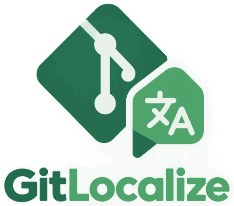
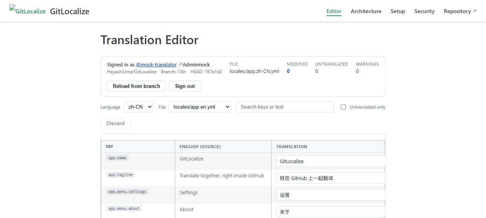
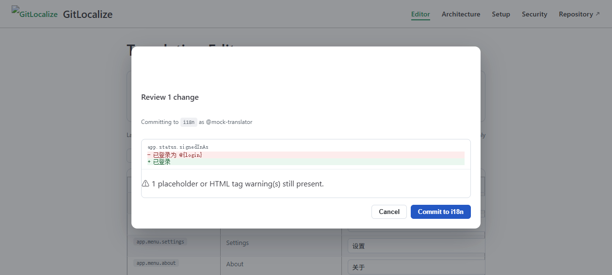
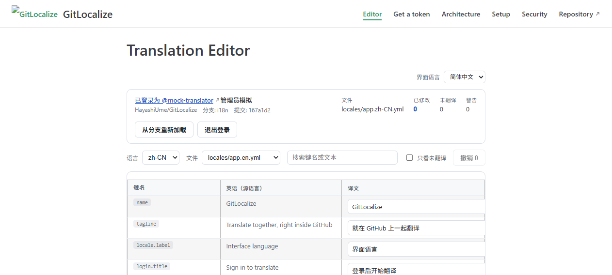

# GitLocalize

A translation collaboration platform that runs entirely on GitHub. No VPS, no application server, no database, no OAuth broker.

The repository is the backend, Git is the database, the pull request is the review system, Actions are the workers, and GitHub Pages serves the front end.

```text
Translator
   │
   ▼
GitHub Pages  (VuePress + translation editor)
   │  api.github.com
   ▼
i18n branch   (translation workspace, commit authored by the translator)
   │
   ▼
GitHub Actions
   ├── ensure an open i18n → main pull request
   ├── merge main back into i18n
   └── rebuild Pages
```

## Layout

```text
.github/
  i18n.yml                    project configuration
  CODEOWNERS                  review routing
  workflows/
    translation-pr.yml        i18n push  → one pull request, reused afterwards
    sync-main-to-i18n.yml     main push  → merge into i18n
    deploy-pages.yml          i18n push  → build and publish Pages
docs/                         VuePress site (published)
locales/                      the editor's own interface strings, in YAML and JSON
src/                          editor, parsers, GitHub API client, QA checks
src/i18n/                     loads locales/ and renders the editor in four languages
tests/                        unit tests for the non-UI layers
scripts/setup-repo.sh         branch rulesets for main and i18n
```

## Quickstart

```bash
npm install
npm run dev      # local site, use /editor.html?mock=1 to work without a token
npm test
npm run build
```

Then open the published editor at `https://<owner>.github.io/<repository>/editor.html`, paste a fine-grained personal access token scoped to that repository, and start translating. [Getting a token](docs/guide/token.md) explains how to create one; [docs/guide/setup.md](docs/guide/setup.md) covers the repository settings.

## What the editor does



- Lists source and target files, discovers languages from `app.zh-CN.yml` style names.
- Flattens nested YAML and JSON into key / source / translation rows.
- Preserves comments in YAML by editing the original document instead of re-emitting it.
- Warns about missing `{placeholders}` and dropped `<b>` tags as you type.
- Commits every changed file as **one** commit through the Git database API, with the translator as the commit author.
- Refuses to commit when the branch head changed underneath you; the ref update is `force: false`.
- Renders its own interface from `locales/`, so the platform is translated with the platform. Switch language in the editor header, or pass `?lang=zh-CN`.



## The editor translates itself



`locales/app.*.yml` and `locales/errors.*.json` are not samples: they are the strings the editor renders. The screenshot above is the editor editing `locales/app.zh-CN.yml` while displaying itself in Chinese — the row `locale.label` reads "Interface language" on the left and "界面语言" on the right, and the header above it is rendered from that same file.

Change `locales/app.zh-CN.yml`, open the editor in Chinese, and the interface follows. That makes the repository a working example of the thing it hosts, and it means a translator can learn the workflow by translating the tool they are looking at.

```yaml
# locales/app.zh-CN.yml
login:
  title: 登录后开始翻译
  tokenLabel: 个人访问令牌

status:
  signedInAs: 已登录为 @{login}
```

Resolution order for the interface language is `?lang=` → stored choice → browser language → English. `tests/i18n.test.ts` keeps the four catalogs honest: identical key sets, identical placeholders and HTML tags, paired plural keys, and no string the components ask for left undefined.

## Design constraints

The original brief forbids a backend, and this implementation keeps to it. Where GitHub's own behaviour gets in the way, the constraint is documented rather than worked around with a server:

- Events created by the default `GITHUB_TOKEN` do not trigger further workflow runs, so the sync workflow dispatches its follow-ups explicitly, or uses an optional `I18N_BOT_TOKEN` secret.
- Repository roles cannot express per-branch push rights, so `main` is protected by a ruleset and `i18n` is protected against force pushes and deletion only.
- Front-end permission checks are user experience; the rulesets and pull request review are the security boundary.

Full detail in [docs/guide/architecture.md](docs/guide/architecture.md) and [docs/guide/security.md](docs/guide/security.md).

## Status

Phase 1–7 of the implementation plan are in place: parser layer, editor, GitHub API integration, commit path, pull request automation, branch sync and Pages deployment. Glossary, translation memory, reviewer workflow and extra file formats are deliberately out of scope for the first version.

## License

MIT
